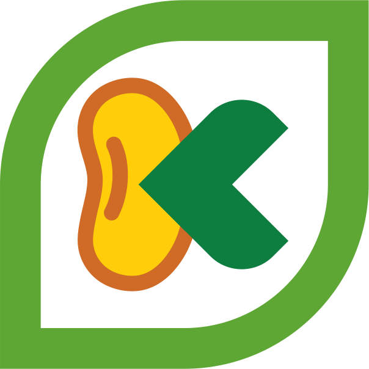

[![Contributors][contributors-shield]][contributors-url]
[![Forks][forks-shield]][forks-url]
[![Stargazers][stars-shield]][stars-url]
[![Issues][issues-shield]][issues-url]
[![MIT License][license-shield]][license-url]
[![LinkedIn][linkedin-shield]][linkedin-url]
<!-- PROJECT LOGO -->
 

  

  <h3 align="center">Kedele.Me</h3>

  

    Project PPL Agro Kelas C 
     
    <a href="https://github.com/noobiesdev/kedele"><strong>Jelajahi Dokumentasi »</strong></a>
     
     
    <a href="http://kedele.me">Tampilkan Demo</a>
    ·
    <a href="https://github.com/noobiesdev/kedele/issues">Laporkan Bug</a>
    ·
    <a href="https://github.com/noobiesdev/kedele/issues">Sarankan Fitur</a>
  

<!-- TABLE OF CONTENTS -->

## Daftar isi
* [Deskripsi Projek](#deskripsi-projek)
  * [Dikembangkan Menggunakan](#dikembangkan-menggunakan)
* [Tim Pengembang](#tim-pengembang)

## Deskripsi Projek
Projek ini ditujukan untuk pengembangan aplikasi berbasis website guna membantu industri disektor agro, khususnya pengusaha dengan produk olahan berbahan kedelai. Layanan yang disediakan meliputi penyediaan bahan baku melalui relasi supplier yang nantinya akan disalurkan kepada pengelola sesuai permintaan yang diajukan.
### Dikembangkan Menggunakan
Dalam pengembangan projek ini, kami menggunakan beberapa framework penunjang antara lain:
* [Bootstrap](https://getbootstrap.com)
* [JQuery](https://jquery.com)
* [Laravel](https://laravel.com)
## Tim Pengembang
- **Analyst** AFRILIA PERMATASARI (18'1027)
- **Tester** <a href="https://github.com/UKha11/">SITI MASRUKHA (18'1051) </a>
- **Programmer** <a href="https://github.com/noobiesdev/">FERNALDI WIDHARSONO (18'1083) </a>
- **Project Manager** <a href="https://github.com/darkun7">HARTAWAN BAHARI MULYADI (18'1113)</a>
- **Designer** DIMAS WAHYU ROSSEVIN (18'2067)

<!-- MARKDOWN LINKS & IMAGES -->
<!-- Reference: https://github.com/othneildrew/Best-README-Template -->
<!-- https://www.markdownguide.org/basic-syntax/#reference-style-links -->
[contributors-shield]: https://img.shields.io/github/contributors/noobiesdev/kedele
[contributors-url]: https://github.com/noobiesdev/kedele/graphs/contributors
[forks-shield]: https://img.shields.io/github/forks/noobiesdev/kedele.svg?style=flat-square
[forks-url]: https://github.com/noobiesdev/kedele/network/members
[stars-shield]: https://img.shields.io/github/stars/noobiesdev/kedele.svg?style=flat-square
[stars-url]: https://github.com/othneildrew/noobiesdev/kedele/stargazers
[issues-shield]: https://img.shields.io/github/issues/noobiesdev/kedele.svg?style=flat-square
[issues-url]: https://github.com/noobiesdev/kedele/issues
[license-shield]: https://img.shields.io/github/license/noobiesdev/kedele.svg?style=flat-square
[license-url]: https://github.com/othneildrew/noobiesdev/kedele/blob/master/LICENSE.txt
[linkedin-shield]: https://img.shields.io/badge/-LinkedIn-black.svg?style=flat-square&logo=linkedin&colorB=555
[linkedin-url]: https://linkedin.com/in/hartawan-bahari-mulyadi-973a311b4/
